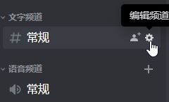
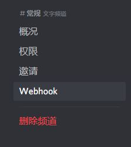
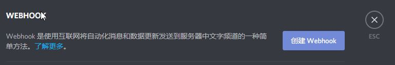

# DOTA2监视下分小助手

一个用来监视队友下分的小工具, 当打完一场对局后会自动将对局详情发送到聊天工具, 目前仅支持Discord.

在使用之前, 请编辑**contents.py**的**WEBHOOKS**变量以添加频道Webhook url以及**PERSON**添加player id以及昵称.

需要安装requests, 使用以下命令来安装

```
python -m pip install -r requirements.txt
```

初次使用推荐 `python task.py -f` 来避免发送过多比赛详情.

之后使用 `python task.py` 来运行就好.

如果不喜欢初始语句的话可以编辑**WIN_NEGATIVE, WIN_POSTIVE, LOSE_NEGATIVE, LOSE_POSTIVE**四个变量来修改.

如果大佬们用的开心的话可以点个STAR支持一下.

# 如何获得Discord的Webhook

首先确保你拥有频道的管理权限.

点击一个文字频道的设置按钮



选择Webhook.



点击创建Webhook后将url复制下来即可.



你会得到一个类似

`https://discordapp.com/api/webhooks/734684555256135710/JRj9xEbxHJ6scZ_XchVMO6YjmpXR88LSkoblSSxQQ-CEC6X9oH7YUa_qND1kAy-vPE96`

这样的URL, 将它放到contents.py内的WEBHOOKS变量内即可.